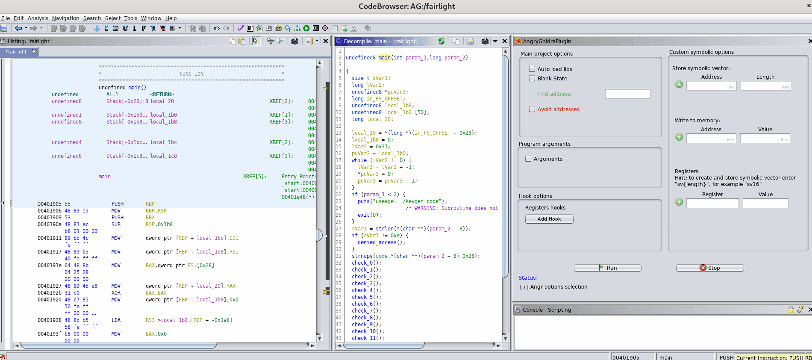
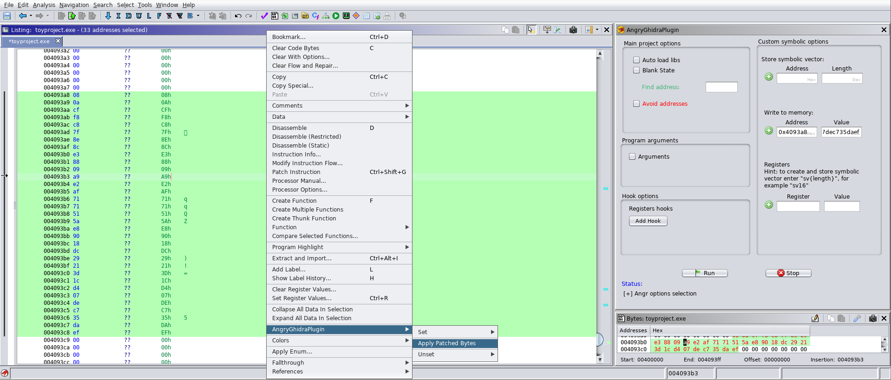

# AngryGhidra

This project was initially started as a part of [Digital Security](https://github.com/DSecurity)'s Research Centre internship ["Summer of Hack 2020"](https://dsec.ru/about/summerofhack/).

The plugin allows you to use [angr](https://github.com/angr/angr) for binary analysis and symbolic execution from Ghidra interface.

Solving [CTF challenge from SecurityFest 2016 "fairlight"](https://github.com/angr/angr-doc/blob/master/examples/securityfest_fairlight/fairlight) with AngryGhidra plugin:

# Screenshots

Apply patched bytes to write them to the memory of angr project:

# Installation
  
- `pip3 install angr` at first
- Make sure that python3 directory added to the `PATH` (necessarily)
- Download Release version of extension and install it in Ghidra `File → Install Extensions...` 
- Use gradle to build extension: `GHIDRA_INSTALL_DIR=${GHIDRA_HOME} gradle` and use Ghidra to install it: `File → Install Extensions...` 
- Clone this repository to `\Ghidra\Extensions` directory.

